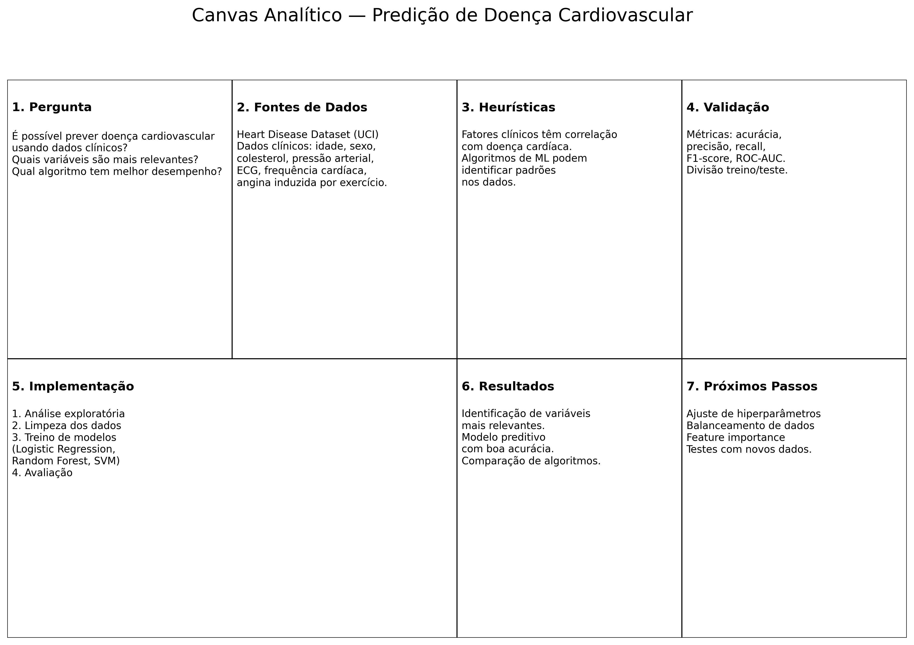

# Introdução

As doenças cardiovasculares representam uma das principais causas de mortalidade no mundo. De acordo com a Organização Mundial da Saúde (OMS), milhões de pessoas morrem anualmente em decorrência dessas doenças, muitas vezes devido ao diagnóstico tardio ou à dificuldade em identificar fatores de risco de forma precoce. Nesse contexto, a utilização de técnicas de análise de dados e aprendizado de máquina é uma abordagem promissora para auxiliar profissionais da saúde na identificação de padrões associados à presença de doenças cardíacas.

A priori, o projeto de pesquisa e experimentação tem como objetivo investigar e experimentar modelos de aprendizado de máquina aplicados ao dataset Heart Disease, disponível no repositório da UCI Machine Learning Repository. Esse conjunto de dados reúne informações clínicas e demográficas de pacientes coletadas em diferentes instituições hospitalares, incluindo características como idade, sexo, pressão arterial, níveis de colesterol e resultados de exames cardíacos.

Além disso, temos como proposta explorar esses dados para compreender quais variáveis apresentam maior relação com a ocorrência de doença cardíaca e avaliar modelos capazes de prever a presença da doença a partir dessas características. A investigação busca contribuir para a compreensão de como técnicas de mineração de dados podem apoiar processos de análise em contextos médicos.

Assim, nosso projeto se insere no contexto de experimentação acadêmica em ciência de dados e aprendizado de máquina, com foco na análise de dados clínicos e na avaliação de modelos preditivos que possam auxiliar na identificação de riscos associados a doenças cardiovasculares.

## Problema

As doenças cardíacas são frequentemente diagnosticadas por meio da análise conjunta de diversos exames clínicos e históricos médicos dos pacientes. No entanto, a interpretação dessas informações pode ser complexa, especialmente quando diferentes variáveis precisam ser consideradas simultaneamente para identificar padrões associados à presença da doença.

Em muitos casos, médicos e profissionais de saúde precisam analisar um grande volume de informações clínicas, como idade, níveis de colesterol, pressão arterial, frequência cardíaca e resultados de exames específicos. A dificuldade em identificar rapidamente relações entre essas variáveis pode tornar o processo de diagnóstico mais demorado ou menos preciso.

Nesse contexto, técnicas de análise de dados e aprendizado de máquina podem auxiliar na identificação de padrões que indicam maior probabilidade de ocorrência de doença cardíaca. A partir da análise de dados históricos de pacientes, é possível explorar modelos capazes de reconhecer combinações de características associadas ao diagnóstico da doença.

O presente projeto utiliza o dataset Heart Disease como base para experimentação. Esse conjunto de dados contém registros clínicos de pacientes e inclui diversas variáveis médicas que podem estar relacionadas à presença de doença cardíaca. O problema investigado neste trabalho está relacionado à dificuldade de identificar, de forma sistemática, quais fatores apresentam maior influência no diagnóstico e se modelos de aprendizado de máquina são capazes de realizar essa previsão de forma confiável.

A investigação será conduzida em um contexto acadêmico, utilizando ferramentas de análise de dados e bibliotecas de aprendizado de máquina amplamente utilizadas na área de ciência de dados. O objetivo é explorar o potencial dessas técnicas para apoiar a análise de dados médicos e compreender melhor os padrões presentes no conjunto de dados estudado.

## Questão de pesquisa

A questão de pesquisa orienta o desenvolvimento deste projeto e define o foco principal da investigação.

Diante do problema apresentado, busca-se investigar se é possível utilizar técnicas de aprendizado de máquina para identificar padrões relevantes nos dados clínicos de pacientes e prever a presença de doença cardíaca com base nessas informações.

Dessa forma, a questão de pesquisa que orienta este trabalho é:

É possível utilizar modelos de aprendizado de máquina para prever a presença de doença cardíaca em pacientes com base em características clínicas presentes no dataset Heart Disease?

Ao longo do projeto, serão analisados diferentes modelos e técnicas de aprendizado de máquina com o objetivo de avaliar sua capacidade de identificar padrões nos dados e responder a essa questão de forma fundamentada.

## Objetivos preliminares

Objetivo geral

Experimentar e avaliar modelos de aprendizado de máquina aplicados ao dataset Heart Disease, buscando identificar abordagens capazes de prever a presença de doença cardíaca a partir de características clínicas dos pacientes.

Objetivos específicos

Objetivo específico 1:
Realizar a análise exploratória do dataset para compreender a distribuição das variáveis, identificar possíveis padrões nos dados e verificar a existência de valores ausentes ou inconsistências.

Objetivo específico 2:
Treinar e comparar diferentes modelos de aprendizado de máquina para prever a presença de doença cardíaca a partir das características disponíveis no dataset.

Objetivo específico 3:
Analisar quais variáveis apresentam maior influência na previsão do modelo, buscando compreender quais fatores podem estar mais associados à presença da doença.

## Justificativa

As doenças cardiovasculares representam um dos maiores desafios para os sistemas de saúde em todo o mundo. Segundo dados da Organização Mundial da Saúde, essas doenças são responsáveis por aproximadamente 17,9 milhões de mortes por ano, correspondendo a cerca de 32% de todas as mortes globais. Grande parte desses casos poderia ser evitada por meio da identificação precoce de fatores de risco e da adoção de medidas preventivas.

Nesse contexto, a análise de dados médicos e a aplicação de técnicas de aprendizado de máquina têm se tornado cada vez mais relevantes para apoiar a tomada de decisão na área da saúde. A capacidade de analisar grandes volumes de dados clínicos e identificar padrões que podem não ser facilmente perceptíveis por métodos tradicionais torna essas técnicas ferramentas promissoras para auxiliar na identificação de riscos e no apoio ao diagnóstico.

O dataset Heart Disease, amplamente utilizado em estudos acadêmicos de ciência de dados e aprendizado de máquina, oferece um conjunto de informações clínicas que permite explorar a relação entre diferentes características dos pacientes e a presença de doença cardíaca. A análise desse conjunto de dados possibilita investigar como modelos computacionais podem aprender padrões presentes nos dados e contribuir para a previsão de diagnósticos.

A escolha deste tema se justifica tanto pela relevância do problema no contexto da saúde pública quanto pelo potencial de aplicação de técnicas de mineração de dados e aprendizado de máquina na análise de dados médicos. Além disso, o projeto permite explorar métodos e ferramentas amplamente utilizados na área de ciência de dados, contribuindo para o desenvolvimento de habilidades técnicas e analíticas relacionadas à análise de dados e modelagem preditiva.

## Público-Alvo

Nesta seção, descreva quem poderá se beneficiar com a sua investigação, apresentando os diferentes perfis de pessoas ou grupos impactados.

O objetivo aqui não é definir clientes específicos ou papéis exatos dentro da aplicação, mas sim compreender o perfil dos usuários e partes interessadas. Para isso, considere:
* Conhecimentos prévios relacionados ao domínio do problema e ao uso de tecnologia;
* Nível de familiaridade com recursos digitais e possíveis barreiras de uso;
* Contexto profissional e hierárquico, quando aplicável (ex.: nível de decisão, responsabilidades, área de atuação);
* Necessidades e expectativas que podem ser atendidas pelo projeto.

**Dica:** Seja objetivo e baseie suas descrições em informações reais ou plausíveis para o contexto escolhido. Isso ajudará a manter o foco no desenvolvimento de soluções relevantes e aplicáveis.

> **Links Úteis**:
> - [Público-alvo](https://blog.hotmart.com/pt-br/publico-alvo/)
> - [Como definir o público alvo](https://exame.com/pme/5-dicas-essenciais-para-definir-o-publico-alvo-do-seu-negocio/)
> - [Público-alvo: o que é, tipos, como definir seu público e exemplos](https://klickpages.com.br/blog/publico-alvo-o-que-e/)
> - [Qual a diferença entre público-alvo e persona?](https://rockcontent.com/blog/diferenca-publico-alvo-e-persona/)

## Estado da arte

Nesta seção, descreva abordagens da literatura que tratam problemas semelhantes ao seu. Seu objetivo é documentar métodos, dados, métricas e resultados.

### O que levantar (mínimo 5 trabalhos)
Para **cada estudo encontrado** aderente à temática do grupo, registre de forma objetiva:
* Problema e contexto: que problema o trabalho buscou resolver e em qual domínio/cenário foi aplicado.
* Dados (dataset): origem, tamanho, período, variáveis/atributos, pré-processamentos relevantes (faltantes, balanceamento, normalização).
* Abordagem/algoritmos: algoritmos utilizados e parâmetros principais (quando informados).
* Métricas de avaliação: quais e por quê (ex.: Acurácia, F1, AUC, RMSE, MAE, etc.).
* Resultados: principais números, comparações internas, limitações citadas e conclusões.

* Texto-síntese crítico (2–4 parágrafos) respondendo:
- O que os estudos concordam? Onde divergem?
- Quais lacunas permanecem (dados, métricas, cenários, limitações técnicas/éticas)?
- Como seu projeto se alinha aos estudos identificados?

**Dica:** Prefira artigos dos últimos 5 anos ou referências clássicas indispensáveis.

### Ferramentas inteligentes permitidas
Você pode utilizar: Perplexity, SciSpace, Elicit, Research Rabbit, Litmaps.
Use-as para descoberta, organização e triagem de literatura. 

**Atenção:** 
* Sempre acesse a fonte original (PDF/artigo) antes de citar; verifique números e conclusões.
* Registre DOI/URL oficial e dados bibliográficos completos.
* Evite “alucinações” das ferramentas: desconfie de referências sem DOI ou que você não consiga localizar oficialmente.
* Use as ferramentas inteligentes para mapear redes de citação (Research Rabbit), mapas de tópicos (Litmaps), filtrar por período e gerar resumos iniciais (Perplexity/SciSpace/Elicit).
* Leia os trabalhos mais promissores e descarte estudos fora de escopo.

> **Links Úteis**:
> - [Google Scholar](https://scholar.google.com/)
> - [IEEE Xplore](https://ieeexplore.ieee.org/Xplore/home.jsp)
> - [Science Direct](https://www.sciencedirect.com/)
> - [ACM Digital Library](https://dl.acm.org/)

# Descrição do _dataset_ selecionado

Nesta seção, apresente uma visão clara e objetiva do dataset selecionado, incluindo:
* Identificação e origem – Nome, link de acesso, fonte (instituição, repositório, API etc.) e licença de uso.
* Visão geral – Total de registros e atributos, período coberto e breve contextualização.
* Atributos – Tabela com nome, descrição, tipo, unidade de medida (se aplicável) e exemplos de valores.
* Qualidade dos dados – Presença de valores faltantes, inconsistências, duplicatas ou outliers.

**Dica:** Seja objetivo, mas inclua detalhes suficientes para que outra pessoa possa entender e reutilizar o conjunto de dados sem buscar informações extras.

# Canvas analítico

Nesta seção é apresentado o **Canvas Analítico** do projeto, uma ferramenta utilizada para estruturar e organizar as principais dimensões da análise de dados a ser realizada. O canvas auxilia na definição do problema investigado, das fontes de dados utilizadas, das hipóteses consideradas, das etapas de implementação da análise e das formas de validação dos resultados.

O objetivo desse artefato é proporcionar uma visão clara e estruturada do projeto, permitindo alinhar os objetivos analíticos, as decisões metodológicas e os resultados esperados ao longo do desenvolvimento do trabalho.

Nesta etapa inicial do projeto, algumas informações ainda podem estar baseadas em hipóteses ou estimativas preliminares. Entretanto, todas as seções do canvas foram preenchidas de forma coerente com o problema proposto e com o contexto de análise relacionado ***à predição de doença cardiovascular utilizando técnicas de aprendizado de máquina***.

O Canvas Analítico desenvolvido para o projeto é apresentado a seguir.

# Vídeo de apresentação da Etapa 01

Nesta etapa, o grupo deverá produzir um vídeo de 5 a 8 minutos apresentando o trabalho realizado, no qual cada integrante deve dizer seu nome e apresentar uma parte do conteúdo desenvolvido, garantindo que todos participem ativamente da gravação. A ausência de participação de qualquer membro resultará em penalização na nota final desta etapa. Recomenda-se que o grupo elabore previamente um roteiro para organizar a ordem das falas, distribuir o tempo de forma equilibrada e assegurar que todos os tópicos relevantes sejam apresentados de maneira clara e objetiva.

# Referências

Inclua todas as referências (livros, artigos, sites, etc) utilizados no desenvolvimento do trabalho utilizando o padrão ABNT.

> **Links Úteis**:
> - [Padrão ABNT PUC Minas](https://portal.pucminas.br/biblioteca/index_padrao.php?pagina=5886)
